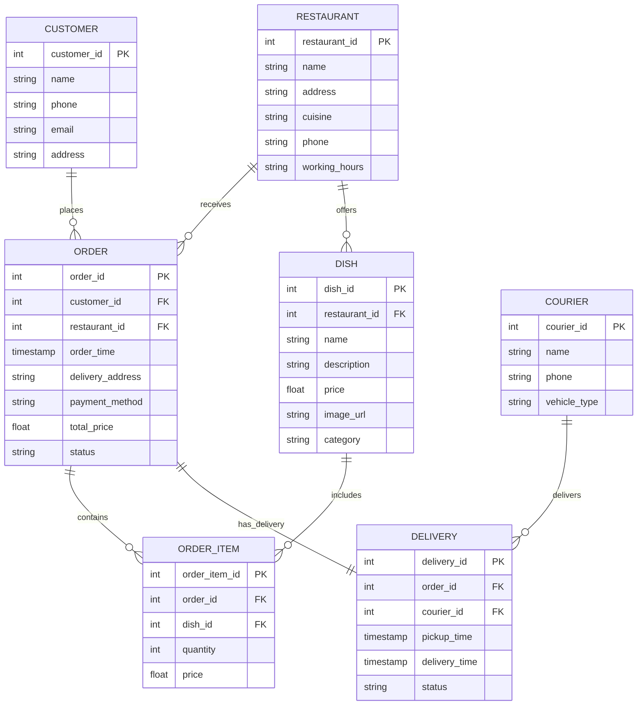

```mermaid
erDiagram
    CUSTOMER {
        int customer_id PK
        string name
        string phone
        string email
        string address
    }
    RESTAURANT {
        int restaurant_id PK
        string name
        string address
        string cuisine
        string phone
        string working_hours
    }
    DISH {
        int dish_id PK
        int restaurant_id FK
        string name
        string description
        float price
        string image_url
        string category
    }
    ORDER {
        int order_id PK
        int customer_id FK
        int restaurant_id FK
        timestamp order_time
        string delivery_address
        string payment_method
        float total_price
        string status
    }
    ORDER_ITEM {
        int order_item_id PK
        int order_id FK
        int dish_id FK
        int quantity
        float price
    }
    COURIER {
        int courier_id PK
        string name
        string phone
        string vehicle_type
    }
    DELIVERY {
        int delivery_id PK
        int order_id FK
        int courier_id FK
        timestamp pickup_time
        timestamp delivery_time
        string status
    }

    CUSTOMER ||--o{ ORDER : places
    RESTAURANT ||--o{ ORDER : receives
    RESTAURANT ||--o{ DISH : offers
    ORDER ||--o{ ORDER_ITEM : contains
    DISH ||--o{ ORDER_ITEM : includes
    ORDER ||--|| DELIVERY : has_delivery
    COURIER ||--o{ DELIVERY : delivers
```
